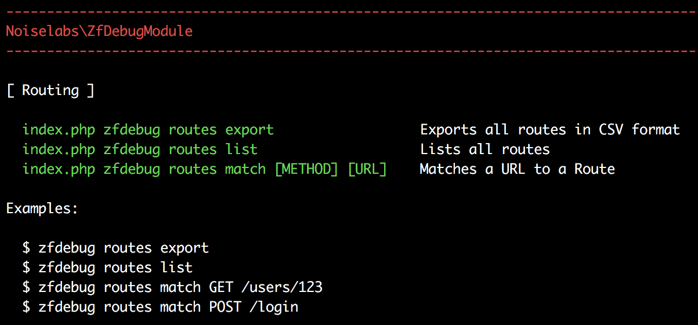
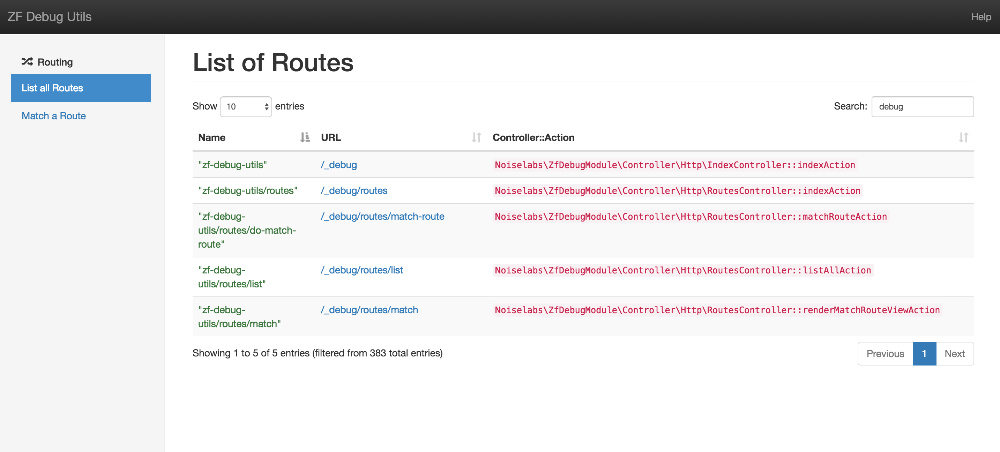
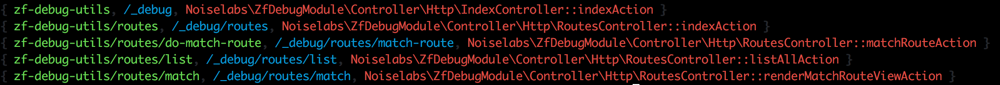
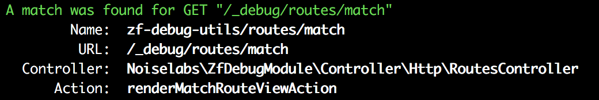
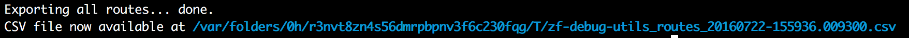

Getting Started
===============

Installation
------------

Install the package via Composer:

```bash
composer require noiselabs/zf-debug-utils
```
    
    
Then enable this module by adding it to `application.config.php`.
    
```php
<?php
'modules' => [
    'Noiselabs\ZfDebugModule',
],
```

## Configuration

Nothing so far. It just works. Soon we will add the possibility of defining a custom root URL for ZfDebugModule URLs.

## What's inside?

ZfDebugModule provides a _WebUI and Console commands for debugging ZF2 apps_.
 
### WebUI

Web URLs are by default mounted at `/_debug`. After installing this module simply navigate to `/_debug` and you should
see the home screen. If you are using the ZendSkeletonApplication the home URL should look similar to this:
 `http://127.0.0.1:8080/_debug`.
 
### Console
 
If you prefer to use the Console type `php public/index.php` at the terminal to see a summary of the available commands.
 
 

## Routing

Routing is the first debug component made available. You have the possibility to list all routes or match a URL to a
route.


### List all Routes

_[ WebUI ]_

Navigate to `/_debug/routes/list` or in the Home screen click in `List all Routes`. These are all the routes available
 in current application. Each column is sortable and you can filter results by using the search input.



_[ Console ]_

    $ php index.php zfdebug routes list




### Match a Route 

_[ WebUI ]_

Navigate to `/_debug/routes/match` or in the Home screen click in `Match a Route`. Provide an HTTP method such as "GET"
or "POST" plus a base URL (omit the scheme) and hit `Find Route`. If the URL matches a route in your application you
 should see something similar to the following picture. You can see details such as the route URL, controller and action.


_[ Console ]_

    $ php index.php zfdebug routes match GET /_debug/routes/match



### Export all routes in CSV format

_[ Console ]_

It is possible to have the output of the [List all Routes](#list-all-routes) feature saved into a CSV file. The generated file can then be loaded by spreadsheet applications and used in reports. 

Note that the export feature is at the moment only available via the Console.

    $ php index.php zfdebug routes export


