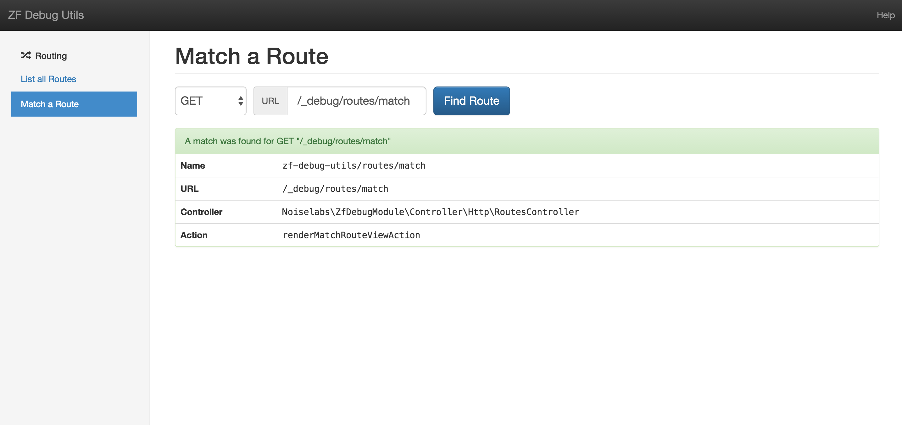

Getting Started
===============

Installation
------------

Install the package via Composer:

```bash
composer require noiselabs/zf-debug-utils
```
    
    
Then enable this module by adding it and `AssetManager` (a dependency) to `application.config.php`.
    
```php
<?php
'modules' => [
    'AssetManager',
    'Noiselabs\ZfDebugModule',
],
```

Configuration
-------------

Nothing so far. It just works. Soon we will add the possibility of defining a custom root URL for ZfDebugModule URLs.

What's inside?
--------------

ZfDebugModule provides a _WebUI and Console commands for debugging ZF2 apps_. However, as stated in the DISCLAIMER:
 _"ZfDebugModule is still at an early development stage. No Console commands were added so far"_. So for now we are
 going to focus on WebUI features only.
 
### WebUI

Web URLs are by default mounted at `/_debug`. After installing this module simply navigate to `/_debug` and you should
see the home screen. If you are using the ZendSkeletonApplication the home URL should look similar to this:
 `http://127.0.0.1:8080/_debug`.

### Routing

Routing is the first debug component made available. You have the possibility to list all routes or match a URL to a
route.


#### List all Routes

Navigate to `/_debug/routes/list` or in the Home screen click in `List all Routes`. These are all the routes available
 in current application. Each column is sortable and you can filter results by using the search input.


#### Match a Route 

Navigate to `/_debug/routes/match` or in the Home screen click in `Match a Route`. Provide an HTTP method such as "GET"
or "POST" plus a base URL (omit the scheme) and hit `Find Route`. If the URL matches a route in your application you
 should see something similar to the following picture. You can see details such as the route URL, controller and action.



 

